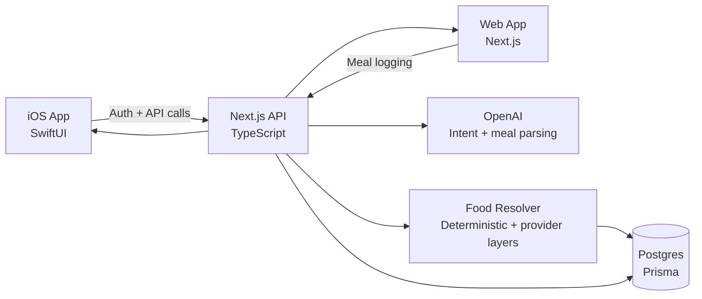

<!-- Capsule Render Banner -->

 

 

<!-- Badges -->

  
  
  
  

  

  

---

## About Me

Hi, I’m Tyler. I study Computer Science & Engineering at The Ohio State University, and most of my time outside class goes into building and maintaining MacroMesh—an AI nutrition app that I’m actively shipping and improving.

I like projects where the details matter: turning messy real-world input into reliable data, building interfaces that feel fast and clear on mobile, and keeping a system stable as features grow. I’m most comfortable working across the stack (SwiftUI + Next.js + TypeScript + Postgres) and I’m looking for software engineering internship and new grad opportunities.

---

## MacroMesh (centerpiece)

  
  
  
  

  
  
  
  
  
  

MacroMesh began as a personal “I wish this existed” project. Meal logging should be fast, but it also has to be trustworthy—especially when an AI is involved. So the core product idea is simple: let the user write food naturally, use AI to help interpret it, and then make every important detail reviewable before it’s saved.

<table width="100%" style="font-size:15px">
  <tr>
    <td width="24%"><b>What it solves</b></td>
    <td>Turns natural-language meal descriptions into structured, reviewable macro logs—without forcing a long, rigid form flow.</td>
  </tr>
  <tr>
    <td><b>Trust model</b></td>
    <td>Nothing is auto-saved. AI output becomes a draft; the user confirms/edits before it becomes history.</td>
  </tr>
  <tr>
    <td><b>Key system</b></td>
    <td>A food resolver pipeline that handles ambiguity, source confidence, and fallback behavior when a match is weak.</td>
  </tr>
  <tr>
    <td><b>Shipping workflow</b></td>
    <td>Vercel for the web/API surface, Codemagic + fastlane/TestFlight for iOS builds.</td>
  </tr>
</table>

### Architecture (high level)

<strong>Engineering notes (the part I spend most of my time on)</strong>

 

<table width="100%" style="font-size:15px">
  <tr>
    <td width="24%"><b>AI meal parsing</b></td>
    <td>The AI is used for intent + structure. Nutrition trust still comes from the resolver/provider pipeline, and every draft stays editable.</td>
  </tr>
  <tr>
    <td><b>Resolver design</b></td>
    <td>Resolver prefers deterministic matches and saved corrections when possible, then uses model assistance when needed. It also produces “this is uncertain” states instead of pretending it knows.</td>
  </tr>
  <tr>
    <td><b>Review-before-save UX</b></td>
    <td>The UI treats the AI output like a suggestion, not a fact. This is the biggest difference between a “cool AI demo” and something people can actually keep using.</td>
  </tr>
  <tr>
    <td><b>Reliability work</b></td>
    <td>When OpenAI is unavailable (or keys aren’t set locally), the app has deterministic fallbacks so the core loop still works during development and testing.</td>
  </tr>
  <tr>
    <td><b>Testing</b></td>
    <td>Guardrails include unit tests and a multi-turn assistant QA suite to catch regressions in logging accuracy and correction behavior.</td>
  </tr>
</table>

<b>Docs worth skimming (if you like seeing the thinking):</b>
 
- https://github.com/TyCodes101/calorie-compass/blob/main/docs/openai-food-intelligence.md
- https://github.com/TyCodes101/calorie-compass/blob/main/docs/food-logging-production-hardening-audit.md
- https://github.com/TyCodes101/calorie-compass/blob/main/docs/NUTRITION_INTELLIGENCE_AUDIT.md

### Development timeline (recent)

<table>
  <tr><td width="18%"><b>July 2026</b></td><td>Improved the resolver flow for ambiguous meal descriptions and expanded automated test coverage around failure modes.</td></tr>
  <tr><td><b>June 2026</b></td><td>Tightened the TestFlight pipeline and reduced friction in the release loop (Codemagic + fastlane handoff).</td></tr>
  <tr><td><b>May 2026</b></td><td>Iterated on the macro dashboard and onboarding to make the core loop faster on mobile.</td></tr>
</table>

### Roadmap

<table>
  <tr><td width="18%"><b>Now</b></td><td>Resolver accuracy, review UX, and reliability under API/provider failure.</td></tr>
  <tr><td><b>Next</b></td><td>Expand food matching coverage, improve caching, and add more confidence/attribution in the UI.</td></tr>
  <tr><td><b>Later</b></td><td>Build out barcode/OCR flows further (kept behind review-first drafts, not auto-save).</td></tr>
</table>

---

## Other Projects

<strong>Stride Step Tracker</strong>

A React Native/Expo app for tracking steps and calorie balance with straightforward daily feedback. I built it with local-first persistence and real empty states, so the UI behaves honestly when there’s no data.

https://github.com/TyCodes101/stride-step-tracker

<strong>CPU Scheduler Visualizer</strong>

A React/Vite visualizer for FCFS, SJF, Priority, and Round Robin scheduling. The goal was to turn OS scheduling into something you can play with and understand quickly.

https://tycodes101.github.io/cpu-scheduler-visualizer/
https://github.com/TyCodes101/cpu-scheduler-visualizer

---

## Toolset (what shows up in my repos)

<table width="100%" style="font-size:15px">
  <tr><td width="24%"><b>Languages</b></td><td>TypeScript, Swift, JavaScript, HTML/CSS</td></tr>
  <tr><td><b>Frameworks</b></td><td>SwiftUI, Next.js, React, Expo</td></tr>
  <tr><td><b>AI</b></td><td>OpenAI API (structured outputs + contracts, meal/intent parsing)</td></tr>
  <tr><td><b>Data</b></td><td>Postgres, Prisma</td></tr>
  <tr><td><b>Deployment</b></td><td>Vercel, GitHub Pages</td></tr>
  <tr><td><b>CI/CD</b></td><td>Codemagic, GitHub Actions</td></tr>
  <tr><td><b>Testing</b></td><td>Vitest, Jest (project-dependent)</td></tr>
</table>

---

## How I Build (practical)

I try to build software people can actually keep using. I keep interfaces simple, test before shipping, and iterate based on what breaks or confuses users. I care a lot about maintainable code because I like revisiting a project months later and still being able to move fast.

---

## Quick Links

  <a href="https://tyler-portfolio-site.vercel.app" target="_blank">Portfolio</a> •
  <a href="https://www.linkedin.com/in/tyler-cox-53b886406" target="_blank">LinkedIn</a> •
  <a href="mailto:Tyler.cox66@yahoo.com" target="_blank">Email</a> •
  <a href="https://github.com/TyCodes101" target="_blank">GitHub</a>

---

## GitHub Analytics (verified providers)

  
  

  

---

<i>Build for real people. Keep it simple. Test before shipping. Learn from every release.</i>
  

